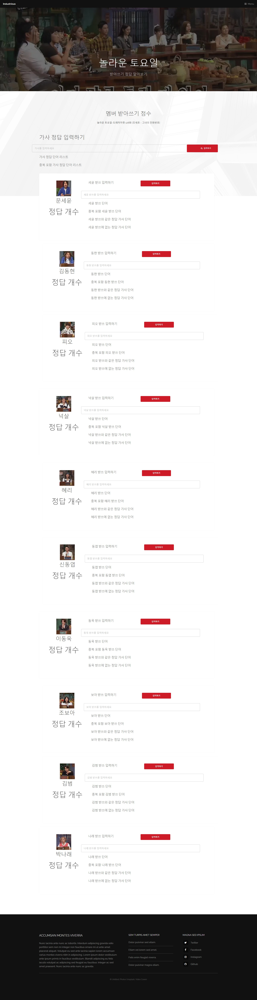
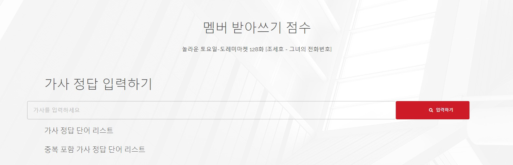
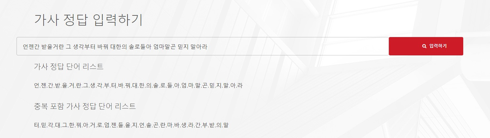
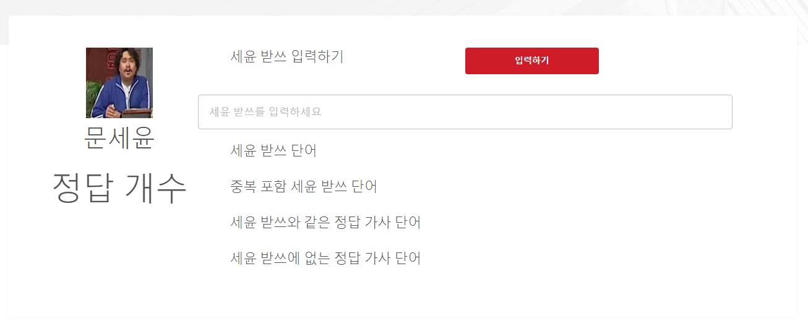
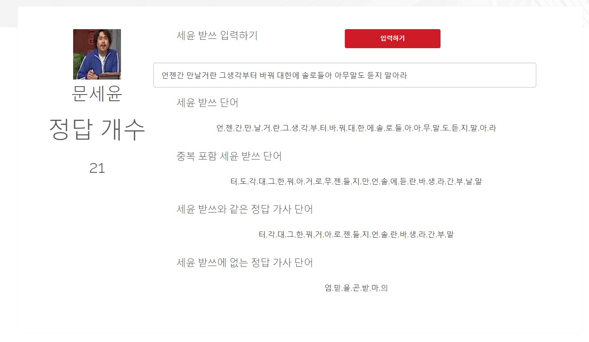

# 놀라운 토요일 받아쓰기 채점기

### 계기

- 128화에서 제작진이 직접 채점하는 장면을 보고 받아쓰기 채점기를 만들어보기로 함
- 이왕 하는거 웹으로 개시하면 좋을 것 같아서 웹까지 구현

### 개발부문

```python
def answer(answer, answer_출연진,출연진이름):
    answer_list = list(''.join(str(answer).split(' ')))
    print('정답 단어 리스트 : ', answer_list)
    print('정답 중복 포함 단어 리스트 : ', set(answer_list))

    answer_출연진_list = list(''.join(str(answer_출연진).split(' ')))
    print(str(출연진이름)+ ' 단어 리스트 : ',answer_출연진_list)
    print(str(출연진이름)+ ' 받쓰 중복 포함 단어 리스트 : ', set(answer_출연진_list))
    
    
    정답_출연진_같은언어 = set(answer_출연진_list).intersection(set(answer_list))
    정답_출연진_다른언어 = set(answer_list).difference(set(answer_출연진_list))
    
    
    print(str(출연진이름)+' 받쓰와 정답 같은 단어 : ',정답_출연진_같은언어)
    print(str(출연진이름)+' 받쓰 정답개수 : ', len(정답_출연진_같은언어))
    
    print(str(출연진이름)+' 받쓰와 정답 다른 단어 : ',정답_출연진_다른언어)
```

- 구현하는건 생각보다 간단했다.
- 우선 정답 가사와 출연자들이 쓴 가사를 입력하여 비교한다.
  - 정답 가사와 출연자 가사들에서 중복을 제거하고 출연자 가사 단어랑 정답 가사 단어랑 겹치는게 무엇인지 `intersection` 으로 찾는다.
  - 이 개수를 반환하고 `difference` 을 이용하여 어떤 단어가 없는지 찾는다.

```python
answer_text = '언젠간 받을거란 그 생각부터 바꿔 대한의 솔로들아 엄마말곤 믿지 말아라'
answer(answer_text,
       '언젠가 다를거라 그 생각부터 바꿔 대한의 솔로들아 아무 느끼 말아라',
      '넉살')
      
>
정답 단어 리스트 :  ['언', '젠', '간', '받', '을', '거', '란', '그', '생', '각', '부', '터', '바', '꿔', '대', '한', '의', '솔', '로', '들', '아', '엄', '마', '말', '곤', '믿', '지', '말', '아', '라']
정답 중복 포함 단어 리스트 :  {'솔', '을', '부', '곤', '생', '각', '받', '란', '아', '언', '로', '말', '라', '의', '그', '들', '간', '대', '거', '터', '한', '꿔', '지', '믿', '바', '엄', '마', '젠'}
넉살 단어 리스트 :  ['언', '젠', '가', '다', '를', '거', '라', '그', '생', '각', '부', '터', '바', '꿔', '대', '한', '의', '솔', '로', '들', '아', '아', '무', '느', '끼', '말', '아', '라']
넉살 받쓰 중복 포함 단어 리스트 :  {'가', '솔', '부', '생', '각', '를', '무', '아', '언', '로', '끼', '라', '느', '말', '의', '그', '들', '대', '거', '터', '한', '꿔', '다', '바', '젠'}
넉살 받쓰와 정답 같은 단어 :  {'터', '들', '한', '솔', '그', '거', '꿔', '아', '부', '생', '대', '언', '각', '로', '바', '젠', '말', '라', '의'}
넉살 받쓰 정답개수 :  19
넉살 받쓰와 정답 다른 단어 :  {'받', '간', '을', '란', '지', '믿', '곤', '엄', '마'}
```

- 이렇게 출력된다.
- 기준은 128화를 기준으로 하였다. 128화 1위는 문세윤과 김범이었다.

```python
answer(answer_text,
       '언젠간 받을거야 그 생각부터하고 대한의 솔로들은 아무 말도 느끼지 말아라',
      '나래')
>
정답 단어 리스트 :  ['언', '젠', '간', '받', '을', '거', '란', '그', '생', '각', '부', '터', '바', '꿔', '대', '한', '의', '솔', '로', '들', '아', '엄', '마', '말', '곤', '믿', '지', '말', '아', '라']
정답 중복 포함 단어 리스트 :  {'엄', '지', '부', '터', '을', '믿', '솔', '꿔', '생', '젠', '받', '한', '바', '의', '들', '란', '간', '곤', '대', '각', '라', '거', '아', '그', '로', '말', '마', '언'}
나래 단어 리스트 :  ['언', '젠', '간', '받', '을', '거', '야', '그', '생', '각', '부', '터', '하', '고', '대', '한', '의', '솔', '로', '들', '은', '아', '무', '말', '도', '느', '끼', '지', '말', '아', '라']
나래 받쓰 중복 포함 단어 리스트 :  {'끼', '고', '지', '부', '터', '을', '솔', '생', '젠', '받', '한', '도', '의', '하', '들', '간', '대', '각', '무', '라', '느', '거', '아', '그', '로', '말', '언', '야', '은'}
나래 받쓰와 정답 같은 단어 :  {'지', '터', '부', '을', '솔', '생', '젠', '받', '한', '의', '들', '간', '대', '각', '라', '거', '아', '그', '로', '말', '언'}
나래 받쓰 정답개수 :  21
나래 받쓰와 정답 다른 단어 :  {'엄', '란', '곤', '바', '믿', '마', '꿔'}
```

```python
answer(answer_text,
       '언젠간 만날거란 그생각부터 바꿔 대한에 솔로들아 아무말도 듣지 말아라',
      '세윤')
>
정답 단어 리스트 :  ['언', '젠', '간', '받', '을', '거', '란', '그', '생', '각', '부', '터', '바', '꿔', '대', '한', '의', '솔', '로', '들', '아', '엄', '마', '말', '곤', '믿', '지', '말', '아', '라']
정답 중복 포함 단어 리스트 :  {'엄', '지', '부', '터', '을', '믿', '솔', '꿔', '생', '젠', '받', '한', '바', '의', '들', '란', '간', '곤', '대', '각', '라', '거', '아', '그', '로', '말', '마', '언'}
세윤 단어 리스트 :  ['언', '젠', '간', '만', '날', '거', '란', '그', '생', '각', '부', '터', '바', '꿔', '대', '한', '에', '솔', '로', '들', '아', '아', '무', '말', '도', '듣', '지', '말', '아', '라']
세윤 받쓰 중복 포함 단어 리스트 :  {'지', '부', '터', '듣', '솔', '꿔', '생', '젠', '한', '도', '바', '날', '들', '란', '만', '간', '대', '각', '무', '라', '거', '아', '그', '로', '에', '말', '언'}
세윤 받쓰와 정답 같은 단어 :  {'지', '터', '부', '솔', '꿔', '생', '젠', '한', '바', '들', '란', '간', '대', '각', '라', '거', '아', '그', '로', '말', '언'}
세윤 받쓰 정답개수 :  21
세윤 받쓰와 정답 다른 단어 :  {'엄', '받', '곤', '을', '믿', '의', '마'}
```

```python
answer(answer_text,
       '언젠가 받을거란 그 생각부터 대한의 솔로들아 아무말도 듣지 말아라',
      '김범')
정답 단어 리스트 :  ['언', '젠', '간', '받', '을', '거', '란', '그', '생', '각', '부', '터', '바', '꿔', '대', '한', '의', '솔', '로', '들', '아', '엄', '마', '말', '곤', '믿', '지', '말', '아', '라']
정답 중복 포함 단어 리스트 :  {'엄', '지', '부', '터', '을', '믿', '솔', '꿔', '생', '젠', '받', '한', '바', '의', '들', '란', '간', '곤', '대', '각', '라', '거', '아', '그', '로', '말', '마', '언'}
김범 단어 리스트 :  ['언', '젠', '가', '받', '을', '거', '란', '그', '생', '각', '부', '터', '대', '한', '의', '솔', '로', '들', '아', '아', '무', '말', '도', '듣', '지', '말', '아', '라']
김범 받쓰 중복 포함 단어 리스트 :  {'지', '부', '터', '을', '듣', '솔', '생', '젠', '받', '한', '도', '의', '들', '란', '대', '각', '무', '라', '거', '아', '그', '로', '말', '언', '가'}
김범 받쓰와 정답 같은 단어 :  {'지', '터', '부', '을', '솔', '생', '젠', '받', '한', '의', '들', '란', '대', '각', '라', '거', '아', '그', '로', '말', '언'}
김범 받쓰 정답개수 :  21
김범 받쓰와 정답 다른 단어 :  {'엄', '간', '곤', '바', '믿', '마', '꿔'}      
```

```python
answer(answer_text,
       '언젠가 발을 걸어 그 생각부터 말고 대한의 솔로들아 아무말고 느낌알아라',
      '혜리')
>
정답 단어 리스트 :  ['언', '젠', '간', '받', '을', '거', '란', '그', '생', '각', '부', '터', '바', '꿔', '대', '한', '의', '솔', '로', '들', '아', '엄', '마', '말', '곤', '믿', '지', '말', '아', '라']
정답 중복 포함 단어 리스트 :  {'엄', '지', '부', '터', '을', '믿', '솔', '꿔', '생', '젠', '받', '한', '바', '의', '들', '란', '간', '곤', '대', '각', '라', '거', '아', '그', '로', '말', '마', '언'}
혜리 단어 리스트 :  ['언', '젠', '가', '발', '을', '걸', '어', '그', '생', '각', '부', '터', '말', '고', '대', '한', '의', '솔', '로', '들', '아', '아', '무', '말', '고', '느', '낌', '알', '아', '라']
혜리 받쓰 중복 포함 단어 리스트 :  {'고', '부', '터', '을', '솔', '알', '생', '젠', '한', '의', '낌', '들', '대', '각', '무', '라', '느', '아', '그', '로', '어', '말', '걸', '발', '언', '가'}
혜리 받쓰와 정답 같은 단어 :  {'아', '터', '생', '부', '젠', '한', '들', '그', '로', '말', '을', '대', '의', '솔', '각', '언', '라'}
혜리 받쓰 정답개수 :  17
혜리 받쓰와 정답 다른 단어 :  {'거', '엄', '지', '란', '받', '간', '곤', '바', '믿', '마', '꿔'}
```

```python
answer(answer_text,
       '언젠가 받을거라 그 생각부터 대화의 솔로부로 말아라',
      '피오')
>
정답 단어 리스트 :  ['언', '젠', '간', '받', '을', '거', '란', '그', '생', '각', '부', '터', '바', '꿔', '대', '한', '의', '솔', '로', '들', '아', '엄', '마', '말', '곤', '믿', '지', '말', '아', '라']
정답 중복 포함 단어 리스트 :  {'엄', '지', '부', '터', '을', '믿', '솔', '꿔', '생', '젠', '받', '한', '바', '의', '들', '란', '간', '곤', '대', '각', '라', '거', '아', '그', '로', '말', '마', '언'}
피오 단어 리스트 :  ['언', '젠', '가', '받', '을', '거', '라', '그', '생', '각', '부', '터', '대', '화', '의', '솔', '로', '부', '로', '말', '아', '라']
피오 받쓰 중복 포함 단어 리스트 :  {'거', '아', '라', '생', '젠', '받', '그', '부', '터', '화', '로', '을', '대', '말', '의', '각', '솔', '언', '가'}
피오 받쓰와 정답 같은 단어 :  {'거', '아', '생', '부', '젠', '받', '그', '터', '로', '말', '을', '대', '의', '각', '솔', '언', '라'}
피오 받쓰 정답개수 :  17
피오 받쓰와 정답 다른 단어 :  {'엄', '지', '들', '란', '한', '간', '곤', '바', '믿', '마', '꿔'}
```

```python
answer(answer_text,
       '언젠가 반할거라 그 생각으로 대한의 솔로들아 아무말도 듣지 말아라',
      '동엽')
>
정답 단어 리스트 :  ['언', '젠', '간', '받', '을', '거', '란', '그', '생', '각', '부', '터', '바', '꿔', '대', '한', '의', '솔', '로', '들', '아', '엄', '마', '말', '곤', '믿', '지', '말', '아', '라']
정답 중복 포함 단어 리스트 :  {'엄', '지', '부', '터', '을', '믿', '솔', '꿔', '생', '젠', '받', '한', '바', '의', '들', '란', '간', '곤', '대', '각', '라', '거', '아', '그', '로', '말', '마', '언'}
동엽 단어 리스트 :  ['언', '젠', '가', '반', '할', '거', '라', '그', '생', '각', '으', '로', '대', '한', '의', '솔', '로', '들', '아', '아', '무', '말', '도', '듣', '지', '말', '아', '라']
동엽 받쓰 중복 포함 단어 리스트 :  {'지', '듣', '솔', '생', '할', '젠', '한', '도', '의', '들', '대', '반', '각', '라', '무', '으', '거', '아', '그', '로', '말', '언', '가'}
동엽 받쓰와 정답 같은 단어 :  {'거', '아', '지', '생', '들', '젠', '한', '그', '로', '말', '대', '의', '솔', '각', '언', '라'}
동엽 받쓰 정답개수 :  16
동엽 받쓰와 정답 다른 단어 :  {'엄', '터', '부', '란', '받', '간', '곤', '을', '바', '믿', '마', '꿔'}
```

```python
answer(answer_text,
       '너 언젠가는 화낼꺼야 그 생각부터 대화의 본론으로 갈꺼야',
      '동현')
>
정답 단어 리스트 :  ['언', '젠', '간', '받', '을', '거', '란', '그', '생', '각', '부', '터', '바', '꿔', '대', '한', '의', '솔', '로', '들', '아', '엄', '마', '말', '곤', '믿', '지', '말', '아', '라']
정답 중복 포함 단어 리스트 :  {'엄', '지', '부', '터', '을', '믿', '솔', '꿔', '생', '젠', '받', '한', '바', '의', '들', '란', '간', '곤', '대', '각', '라', '거', '아', '그', '로', '말', '마', '언'}
동현 단어 리스트 :  ['너', '언', '젠', '가', '는', '화', '낼', '꺼', '야', '그', '생', '각', '부', '터', '대', '화', '의', '본', '론', '으', '로', '갈', '꺼', '야']
동현 받쓰 중복 포함 단어 리스트 :  {'낼', '부', '터', '꺼', '너', '생', '젠', '의', '갈', '론', '는', '대', '각', '본', '으', '화', '그', '로', '언', '가', '야'}
동현 받쓰와 정답 같은 단어 :  {'생', '터', '젠', '부', '그', '로', '대', '의', '각', '언'}
동현 받쓰 정답개수 :  10
동현 받쓰와 정답 다른 단어 :  {'거', '엄', '아', '지', '들', '란', '한', '받', '간', '곤', '을', '바', '믿', '말', '솔', '마', '라', '꿔'}
```

```python
answer(answer_text,
       '언젠간 받은전화 그 생각 부 대화는 서론으로',
      '보아')
>
정답 단어 리스트 :  ['언', '젠', '간', '받', '을', '거', '란', '그', '생', '각', '부', '터', '바', '꿔', '대', '한', '의', '솔', '로', '들', '아', '엄', '마', '말', '곤', '믿', '지', '말', '아', '라']
정답 중복 포함 단어 리스트 :  {'엄', '지', '부', '터', '을', '믿', '솔', '꿔', '생', '젠', '받', '한', '바', '의', '들', '란', '간', '곤', '대', '각', '라', '거', '아', '그', '로', '말', '마', '언'}
보아 단어 리스트 :  ['언', '젠', '간', '받', '은', '전', '화', '그', '생', '각', '부', '대', '화', '는', '서', '론', '으', '로']
보아 받쓰 중복 포함 단어 리스트 :  {'으', '생', '부', '젠', '받', '화', '그', '로', '간', '전', '대', '각', '언', '론', '서', '은', '는'}
보아 받쓰와 정답 같은 단어 :  {'부', '생', '젠', '받', '그', '로', '간', '대', '각', '언'}
보아 받쓰 정답개수 :  10
보아 받쓰와 정답 다른 단어 :  {'거', '엄', '아', '지', '터', '들', '한', '란', '곤', '말', '을', '바', '믿', '의', '솔', '마', '라', '꿔'}
```

```python
answer(answer_text,
       '언젠가 반할거라 그 생각부터 바꿔 대한의 솔로들아 믿지 말아라',
      '동욱')
>
정답 단어 리스트 :  ['언', '젠', '간', '받', '을', '거', '란', '그', '생', '각', '부', '터', '바', '꿔', '대', '한', '의', '솔', '로', '들', '아', '엄', '마', '말', '곤', '믿', '지', '말', '아', '라']
정답 중복 포함 단어 리스트 :  {'엄', '지', '부', '터', '을', '믿', '솔', '꿔', '생', '젠', '받', '한', '바', '의', '들', '란', '간', '곤', '대', '각', '라', '거', '아', '그', '로', '말', '마', '언'}
동욱 단어 리스트 :  ['언', '젠', '가', '반', '할', '거', '라', '그', '생', '각', '부', '터', '바', '꿔', '대', '한', '의', '솔', '로', '들', '아', '믿', '지', '말', '아', '라']
동욱 받쓰 중복 포함 단어 리스트 :  {'지', '부', '터', '믿', '솔', '꿔', '생', '할', '젠', '한', '바', '의', '들', '대', '반', '각', '라', '거', '아', '그', '로', '말', '언', '가'}
동욱 받쓰와 정답 같은 단어 :  {'지', '터', '부', '믿', '솔', '꿔', '생', '젠', '한', '바', '의', '들', '대', '각', '라', '거', '아', '그', '로', '말', '언'}
동욱 받쓰 정답개수 :  21
동욱 받쓰와 정답 다른 단어 :  {'엄', '란', '받', '간', '곤', '을', '마'}
```

- 보면 나래, 동욱의 정답도 21개이다. 그럼 공동 1위가 4명이어야 했는데 어떠한 점이 다른지 시청자게시판에 문의를 남겨놓았다. 

### 웹부문

- 완성된 웹 화면이다. 몇시간 안에 작성하느라 퀄리티는 높지 않다. 기능에만 중점을 두었다.



#### views.py

```python
def answer_list(request):
    answer = request.POST['answer']
    print(answer)

    def answer2(answer):
        answer_list = list(''.join(str(answer).split(' ')))
        answer_list_set = list(set(answer_list))

        return answer_list ,answer_list_set

    answer_list, answer_list_set = answer2(answer)
    context = {
        'answer_list' : answer_list,
        'answer_list_set' :answer_list_set
    }

    data = [context]
    return JsonResponse(data, safe=False)


def answer3(request):
    answer = request.POST['answer']
    answer_출연진 = request.POST['answer_출연진']

    def answer4(answer, answer_출연진):
        answer_list = list(''.join(str(answer).split(' ')))

        answer_출연진_list = list(''.join(str(answer_출연진).split(' ')))
        answer_출연진_list_set = set(answer_출연진_list)

        정답_출연진_같은언어 = list(set(answer_출연진_list).intersection(set(answer_list)))
        정답_출연진_다른언어 = list(set(answer_list).difference(set(answer_출연진_list)))

        return 정답_출연진_같은언어, 정답_출연진_다른언어, len(정답_출연진_같은언어), list(answer_출연진_list_set), answer_출연진_list

    정답_출연진_같은언어, 정답_출연진_다른언어, 정답개수, answer_출연진_list_set, answer_출연진_list = answer4(answer, answer_출연진)

    data = [{
        'answer_출연진_list' : answer_출연진_list,
        '정답_출연진_같은언어' : 정답_출연진_같은언어,
        '정답_출연진_다른언어' : 정답_출연진_다른언어,
        '정답개수' : 정답개수,
        'answer_출연진_list_set' : answer_출연진_list_set
    }]

    return JsonResponse(data, safe=False)
```

#### 정답 가사 분석



```html
<header class="content">
                        <h2>가사 정답 입력하기</h2>
                        <div class="row">
                        <input  placeholder="가사를 입력하세요" type="text"  id='answer' class="col-10" style=" background-color:transparent;">
                        <button class="button primary icon fa-search col-2" id="result" style="text-align: center">입력하기</button>
                        </div>
                        <h3 style="margin-top: 20px;">가사 정답 단어 리스트</h3>
                        <div id='one'></div>
                        <h3 style="margin-top: 20px;">중복 포함 가사 정답 단어 리스트</h3>
                        <div id='two'></div>
                    </header>
```

- 가사 입력 부분을 view에 보낸다.

```html
$(document).ready(function() {
                $('#result').click(function() {
                    $.ajax({
                        url : "",
                        type : 'post',
                        data : { 'csrfmiddlewaretoken' : '{{csrf_token}}',
                                answer : $('#answer').val()
                                },
                        dataType : 'json',
                        success : function(data) {
                            $('#one').empty()
                            $('#one').html('<p>'+data[0].answer_list+'</p>')
                            $('#two').empty()
                            $('#two').html('<p>'+data[0].answer_list_set+'</p>')
                        }
                    })
                })
```

- 그러면 views에 만든 함수를 실행한다.



- 그럼 다음과 같이 비동기방식으로 값을 띄어준다.

#### 출연자 가사 분석



```html
<section style="width: 100%">
							<header class="content">
                                <div class="row">
                                    <div class="col-3 col-lg-3">
									
									<h2>문세윤</h2>
                                    <h1> 정답 개수</h1>
                                    <h2 id="one_sum"></h2>
                                    </div>
                                    <div class="row col-9">
                                        <label for="two-result" style="text-align: left;"  class="col-6"><h3>세윤 받쓰 입력하기</h3></label>
                                        <a class="button primary small col-3" id="세윤정답_list" >입력하기</a>
                                        <input  placeholder="세윤 받쓰를 입력하세요" class="col-12" type="text"  id='세윤정답' style=" background-color:transparent;">
                                        <h3 style="margin-top: 20px;">세윤 받쓰 단어</h3>
                                        <div id='one_one' class="col-12"></div>
                                        <h3>중복 포함 세윤 받쓰 단어</h3>
                                        <div id='one_two' class="col-12"></div>
                                        <h3>세윤 받쓰와 같은 정답 가사 단어</h3>
                                        <div id='one_three' class="col-12"></div>
                                        <h3>세윤 받쓰에 없는 정답 가사 단어</h3>
                                        <div id='one_four' class="col-12"></div>
                                    </div>
                                </div>

                            </header>
						</section>
```

- 출연자의 가사를 받아온다.

```html
$('#세윤정답_list').click(function() {
                    $.ajax({
                        url : "",
                        type : 'post',
                        data : { 'csrfmiddlewaretoken' : '{{csrf_token}}',
                                answer : $('#answer').val(),
                                answer_출연진 : $('#세윤정답').val()
                                },
                        dataType : 'json',
                        success : function(data) {
                            $('#one_one').empty()
                            $('#one_one').html('<p>'+data[0].answer_출연진_list+'</p>')
                            $('#one_two').empty()
                            $('#one_two').html('<p>'+data[0].answer_출연진_list_set+'</p>')
                            $('#one_three').empty()
                            $('#one_three').html('<p>'+data[0].정답_출연진_같은언어+'</p>')
                            $('#one_four').empty()
                            $('#one_four').html('<p>'+data[0].정답_출연진_다른언어+'</p>')
                            $('#one_sum').empty()
                            $('#one_sum').html('<p>'+data[0].정답개수+'</p>')
                        }
                    })
                })
```

- 다음과 같이 함수를 보내서 비동기방식으로 값을 받아서 업데이트 시킨다.



- 그러면 이렇게 분석한 내용이 뜬다. 정답 개수도 볼 수 있다.
- 나중에는 순위별로 나열하는 등 보완해보려고 한다.